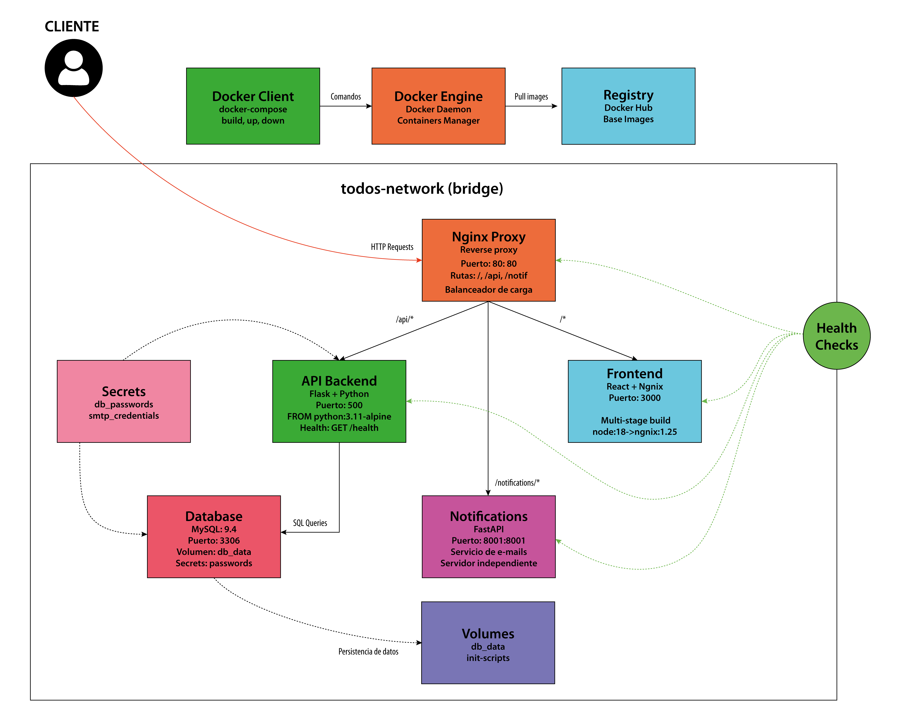

# TODO App - TP Integrador 2025

## Dockerización Segura y Docker Compose

[](https://www.docker.com/)
[](https://reactjs.org/)
[](https://flask.palletsprojects.com/)
[](https://www.mysql.com/)
[](https://fastapi.tiangolo.com/)
[](https://nginx.org/)
[](https://www.python.org/)

Aplicación de gestión de tareas completamente dockerizada con **énfasis en seguridad y gestión de secretos**, desarrollada como trabajo práctico de la materia DevOps. Implementa arquitectura de microservicios con prácticas de seguridad para simular escenarios reales de producción.

## Requisitos
1. Python 3.x - shell (Linux)
2. Cliente MySQL. ej: Dbeaver, https://dbeaver.io/download/ 
3. Docker, docker compose
4. Node
5. Cliente HTTP 

## Objetivo
Aplicar conocimientos adquiridos en la materia Desarrollo y Operaciones para levantar una aplicación con contenedores en su host, compuesto de 3 microservicios utilizando un proxy para que tanto front y back salgan por el mismo dominio.

Fomentar el trabajo en equipo, la documentación clara y la presentación de resultados.

## Arquitectura del Sistema

### Arquitectura Simplificada


### Arquitectura Docker Completa


## Stack Tecnológico

| Componente | Tecnología | Puerto | Descripción |
|------------|------------|--------|-------------|
| **Frontend** | React 18.2 + Nginx 1.25 | :3000 | Interfaz de usuario para gestión de tareas |
| **Backend API** | Flask 3.1 | :5000 | API REST para operaciones CRUD |
| **Notificaciones** | FastAPI 0.118 | :8001 | Servicio de notificaciones por email |
| **Base de Datos** | MySQL 9.4 | :3306 | Persistencia de datos |
| **Proxy Reverso** | Nginx 1.29 | :80 | Enrutamiento y balanceo |
| **Orquestación** | Docker Compose | - | Gestión de contenedores |
| **Seguridad** | Docker Secrets | - | Gestión segura de credenciales |


## Inicio Rápido

### Prerrequisitos
- Docker y Docker Compose instalados
- Git para clonar el repositorio

### Ejecución
```bash
# Clonar el repositorio
git clone <url-del-repositorio>
cd trabajo-practico-grupo-01

# Construir y ejecutar todos los servicios
./deploy.sh [](https://www.mysql.com/)| **Base de Datos** | MySQL 8.0 | :3306 | Persistencia de datos |

# La aplicación estará disponible en:
# - Frontend: http://localhost (puerto 80)
# - API Backend: http://localhost/api
# - Notificaciones: http://localhost/notifications
```

### Detener la aplicación
```bash
./stop.sh
```

## Documentación Adicional

- **[Gestión de Errores](./ERRORES.md)** - Problemas comunes y soluciones
- **[Documentación de Seguridad](./SEGURIDAD.md)** - Implementación de seguridad y secretos  
- **[Gestión de Secretos](./SECRETS.md)** - Guía detallada de Docker Secrets

## Posibles Mejoras Identificadas

*Esta sección presenta mejoras específicas identificadas para llevar la aplicación TODO a un nivel de producción empresarial.*

### Seguridad Avanzada

#### Implementación de HTTPS/TLS
```yaml
# Propuesta: Agregar certificados SSL
nginx:
  volumes:
    - ./ssl:/etc/nginx/ssl:ro
  ports:
    - "443:443"  # Puerto HTTPS
    - "80:80"    # Redirect a HTTPS
```
**Beneficios**: Encriptación end-to-end, cumplimiento normativo, confianza del usuario

#### Sistema de Autenticación JWT
```python
# Propuesta: Middleware de autenticación
@app.before_request
def authenticate_request():
    if request.endpoint in PROTECTED_ENDPOINTS:
        token = request.headers.get('Authorization')
        validate_jwt_token(token)
```
**Beneficios**: Control de acceso granular, seguridad API mejorada

#### Escaneo Automático de Vulnerabilidades
```bash
# Propuesta: Integrar Trivy en CI/CD
trivy image --severity HIGH,CRITICAL todo-app:latest
docker run --rm -v /var/run/docker.sock:/var/run/docker.sock \
  aquasec/trivy:latest image nginx:alpine
```
**Beneficios**: Detección temprana de CVEs, compliance automatizado

---

### Performance y Escalabilidad

#### Cache Distribuido con Redis
```yaml
# Propuesta: Agregar capa de cache
redis:
  image: redis:7-alpine
  command: redis-server --appendonly yes
  
api:
  environment:
    - REDIS_URL=redis://redis:6379
```
```python
# Implementación de cache
import redis
cache = redis.Redis(host='redis', port=6379, decode_responses=True)

@app.route('/api/todos')
def get_todos():
    cached_todos = cache.get('todos:all')
    if cached_todos:
        return json.loads(cached_todos)
    
    todos = fetch_from_database()
    cache.setex('todos:all', 300, json.dumps(todos))  # Cache 5 min
    return todos
```
**Beneficios**: Reducción de latencia 60-80%, menor carga en DB

#### Load Balancing Horizontal
```yaml
# Propuesta: Múltiples instancias de API
api:
  deploy:
    replicas: 3
  depends_on:
    - db
    - redis

nginx:
  # Configuración de upstream con balanceo
  volumes:
    - ./nginx/load-balance.conf:/etc/nginx/nginx.conf
```
```nginx
# nginx/load-balance.conf
upstream api_cluster {
    least_conn;
    server api_1:5000 weight=1;
    server api_2:5000 weight=1;
    server api_3:5000 weight=1;
}
```
**Beneficios**: Mayor throughput, resistencia a fallos, escalabilidad horizontal

---

## ✅ Checklist de Entrega - Estado del Proyecto

### 1. ✅ **Archivos ignorados correctamente**
- `.gitignore` configurado para excluir `.env`, `secrets/`, `node_modules/`, etc.

### 2. ✅ **Por cada microservicio**
- `api/Dockerfile` - Backend Flask con usuario no-root y optimizaciones
- `web/Dockerfile` - Frontend React con multi-stage build (Node → Nginx)
- `notifications/Dockerfile` - FastAPI con healthcheck y usuario no-root
- `db/Dockerfile` - MySQL 9.4 con scripts de inicialización
- `nginx/Dockerfile` - Proxy reverso optimizado con gestión de entrypoint
- `.dockerignore` en cada servicio para mejorar eficiencia del build

### 3. ✅ **Docker Compose**
- `docker-compose.yml` con todas las imágenes construidas localmente
- Networks, volumes y secrets configurados correctamente
- Health checks implementados para todos los servicios

### 4. ✅ **README.md completo**
- Explicación e introducción del repositorio
- Diagrama de arquitectura 
- Sección de posibles mejoras 
- Links a otros archivos .md 

### 5. ✅ **Glosario de errores**
- `ERRORES.md` con errores presentados y soluciones aplicadas

### 6. ✅ **Documentación de Seguridad**
- `SEGURIDAD.md` documentando gestión de secretos y mejores prácticas
- `SECRETS.md` con guía detallada de Docker Secrets
- Principio de menor privilegio aplicado (usuarios no-root)
- Variables de entorno seguras con Docker Secrets

### 7. ✅ **Script de Ejecución**
- `deploy.sh` automatiza build, run y pruebas de la aplicación
- `stop.sh` para detener servicios de forma limpia
- Pruebas automáticas de que todos los servicios están funcionando
- Soporte para limpiar y recrear todo el ambiente

## Herramientas de Seguridad Implementadas

### **Análisis de Secretos**
- Uso de Docker Secrets para credenciales sensibles
- Archivos `.env` excluidos del repositorio
- Templates `.env.example` para configuración segura

### **Seguridad en Contenedores**
- Imágenes base oficiales:
  - API: `python:3.11-alpine`
  - Web: `node:18-alpine` → `nginx:1.25-alpine` (multi-stage)
  - Notifications: `python:3.11-slim`
  - Database: `mysql:9.4`
  - Nginx: `nginx:1.29-alpine`
- Usuarios no-root en todos los contenedores de aplicación
- Multi-stage builds para reducir superficie de ataque (web)
- Health checks configurados con timeouts apropiados
- Asignación automática de recursos (CPU/RAM) por contenedor
---

### **Comandos Útiles**
```bash
# Ver logs de todos los servicios
docker-compose logs -f

# Ver logs de un servicio específico
docker-compose logs -f api

# Verificar estado de health checks
docker-compose ps

# Reiniciar un servicio específico
docker-compose restart api

# Limpiar todo y empezar desde cero
docker-compose down -v --remove-orphans
docker system prune -f
./deploy.sh
```
---

***TP Integrador 2025 - DevOps | UTN FRC***

*Dockerización Segura y Docker Compose*