# Documentación de Seguridad:


Para el presente documento se detallarán dos aspectos cruciales para
gestionar la seguridad dentro de nuestros contenedores, Gestión de Secretos y Seguridad en Contenedores, haciendo especial énfasis en este.

## Índice de Errores
1. [Herramientas Utilizadas](#herramientas-utilizadas)
2. [Análisis de imagen "todos-api"](#análisis-imagen-todos-api)  
3. [Análisis de imagen "todos-nginx"](#análisis-imagen-todos-nginx)  
4. [Análisis de imagen "todos-db"](#análisis-imagen-mysql80)
5. [Análisis de imagen "todos-web"](#análisis-imagen-todos-web)  
6. [Análisis de imagen "todos-notifications"](#análisis-imagen-todos-notifications)  
7. [Gestión de secretos](#gestión-de-secretos)
---
## Herramientas Utilizadas
**Gestión de Secretos**:

* ```detect-secrets```: Escanea el código en busca de secretos expuestos antes de commitear. Para su uso instalamos detect-secret mediante pip y lo usamos en la raiz de nuestro proyecto mediante el siguiente comando: 
```detect-screts scan > .secrets.baseline```

**Seguridad en Contenedores**:

* ```Trivy```: Es una herramienta que utilizamos para analizar las imagenes construidas desde nuestros dockerfiles en busca de vulnerabilidades, arrojandonos un informe con aquellas encontradas y los parches disponibles que podemos utilizar para solventarlas (Ignoraremos las amenazas de tipo LOW y MEDIUM por motivos
de practicidad). Comando que utilizaremos:
```trivy image \--severity=CRITICAL,HIGH <nombre-imagen>```

* ```Checkov```: Este software se encarga de analizar nuestros dockerfiles (o cualquier otro IaC) en busqueda de vulnerabilidades y malas configuraciones que tengamos en nuestro archivo e informandonos de esto para poder repararlo. Para ejecutarlo utilizamos el siguiente comando que permite correr este software dentro de un contenedor, por lo que no es necesario instalarlo:
```docker run \--rm -v "\$(pwd)":/app bridgecrew/checkov \--directory /app```
---

## Análisis Imagen "todos-api":

#### Trivy:
Realizamos el primer análisis de trivy a esta imagen:
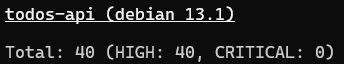
Partimos de una imagen con 40 vulnerabilidades HIGH, todas apuntando a problemas en la imagen base de Debian que tiene la imagen python:3.11-slim

Para solventar esto seguimos el siguiente recorrido:

1. Cambiamos la imagen base por python:3.11-slim-bookworm en el
    dockerfile para ver si actualizando la imagen Base a la última
    versión disponible del tag (no parcheandola) trae consigo la
    resolución de estas vulnerabilidades.\
    Armamos de nuevo la imagen y ejecutamos el test:
    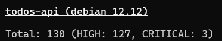
    Sin embargo, al ejecutar un nuevo análisis nos resulta en 127
    vulnerabilidades HIGH y 4 CRITICAL.

2.  Probamos ahora migrando de una imagen *slim* a una *alpine*
    (python:3.11-alpine), sin embargo, para ello debemos instalar
    algunas herramientas extras que no dispone alpine (debido a su
    enfoque minimalista) en nuestro Dockerfile. También fueron
    necesarios realizar algunos ajustes de sintaxis ya que cambian de
    slim a alpine.\
    Sorprendentemente esto redujo las vulnerabilidades de tipo HIGH como
    CRITICAL a 0, quedando solamente una vulnerabilidad de tipo LOW y
    otras 5 de tipo MEDIUM.

Conclusión: El utilizar una imagen base mucho más liviana con menos
dependencias para construir la imagen resulta en un uso más consciente
de las dependencias y herramientas que se utilizarán para construir
dicha imagen, además de reducir notablemente la superficie de ataque ya
que no tiene tantas dependencias. Además, al ser más liviana permite un
arranque más rápido y un menor uso de memoria.


#### Checkov:

Para analizarlo utilizamos el siguiente comando en el directorio en
donde se encuentra nuestro Dockerfile: ```docker run --rm -v $(pwd):/app
bridgecrew/checkov --directory /app```.

Este nos permite ejecutar la prueba por checkov mediante el uso de un
contenedor, por lo que no necesitamos instalar nada en nuestro
dispositivo host ya que el contenedor cuenta con todo lo necesario para
realizar la prueba (otro ejemplo claro del por qué este tipo de
tecnología es tan útil).

Al ejecutar la prueba vemos que pasaron 42 de los 43 tests que plantea
CHECKOV para comprobar la seguridad y las buenas prácticas implementadas
en el dockerfile.

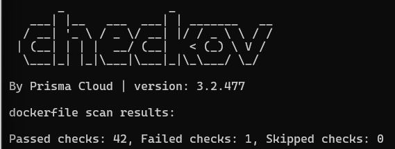

La única prueba que fallaría sería la de **HEALTHCHECK**. Esta
instrucción (que comprueba el estado de nuestro contenedor
periódicamente para saber si está disponible para recibir tráfico) no
fue definida en el dockerfile ya que se definió de antemano en el
docker-compose.

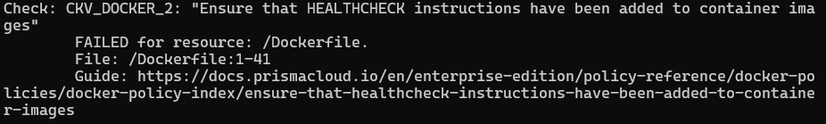

Sin embargo, con el objetivo de completar todos los tests y brindarle
mayor redundancia al contenedor, añadiremos el HEALTHCHECK también al
dockerfile:

HEALTHCHECK en docker-compose.yml:

```yaml
healthcheck:
  test: ["CMD", "python", "-c", "import urllib.request; urllib.request.urlopen('http://localhost:5000/')"]
  interval: 30s
  timeout: 10s
  retries: 3
```

HEALTHCHECK en dockerfile:

```dockerfile
HEALTHCHECK --interval=30s --timeout=10s --retries=3 --start-period=40s CMD CMD python -c "import urllib.request; urllib.request.urlopen('http://localhost:5000/')"
```

Ejecutamos de nuevo el checkov y veremos que ahora todos los tests han
pasado:

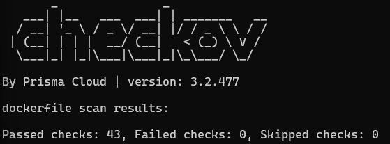

---
## Análisis Imagen "todos-nginx":

#### Trivy:

El problema base radica en la imagen base de nginx:1.25-alpine que se
está utilizando, siendo la principal causa el sistema operativo alpine y
no precisamente nginx.

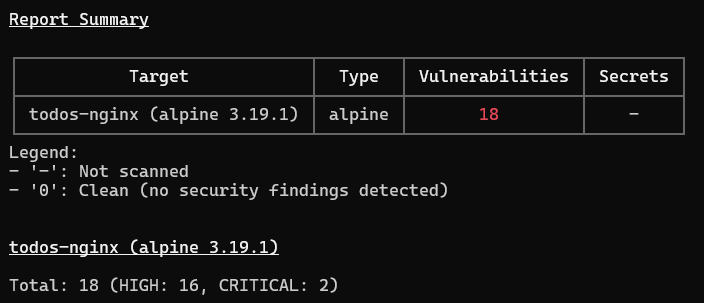

Probamos con una versión mas actualizada de alpine (nginx:1.25-alpine => nginx:1.29-alpine) para verificar si se parchearon estas vulnerabilidades.

Vemos que, efectivamente, al realizar esta corrección se corrigieron
todas las vulnerabilidades de severidad HIGH y CRITICAL de nuestra
imagen.

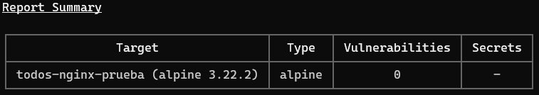

#### Checkov:

De todos los tests realizados, solamente fallaron 2. De nuevo el de
HEALTHCHECK (que lo resolveremos de la misma forma que con todos-api) y
ahora uno nuevo, uno referido a que no se creó ningún usuario para el
contenedor.

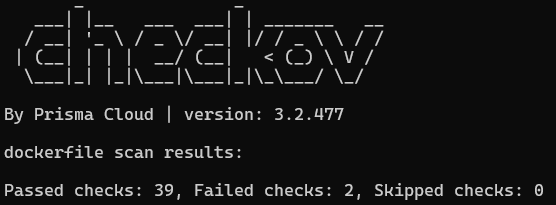

**Resolviendo CKV_DOCKER_2:**

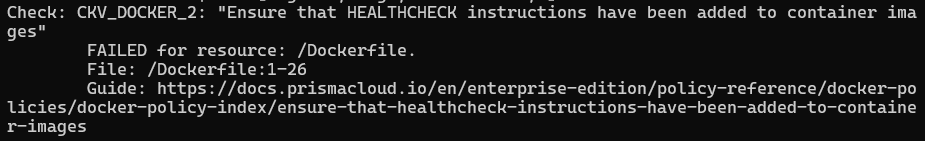

En este caso, también contamos con una instrucción HEALTHCHECK en nuestro docker-compose.yml, por lo que simplemente adaptamos esos comandos a un formato que nuestro Dockerfile pueda entender:

```DOCKERFILE
HEALTHCHECK --interval=30s --timeout=10s --retries=3 CMD curl -f http://localhost/health || exit 1
```

Y ya con eso bastaría para hacer pasar el test.

**Resolviendo CKV_DOCKER_3:**
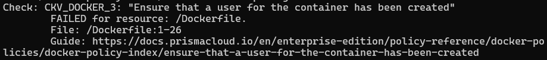

No ocuparnos de este test si representa una situación mas riesgosa, ya que al no tener declarado en nuestro Dockerfile (y en la imagen que se construirá de este) un usuario, Docker le asignaría al contenedor el usuario por defecto de la imagen base con la que se construyó, que en la mayoría de los casos es root. Esto viola el principio de menor privilegio permitiendo a un atacante que pueda explotar alguna vulnerabilidad y acceder a nuestro contenedor tener permisos de administrador. Ganaría un control total del contenedor y, en el peor de los casos, podría escaparse de este y afectar al host que hospeda, no solo al propio contenedor, sinó a todos los que controla el host.

Para resolverlo le asignaremos un usuario sin privilegios por defecto que dispone nginx y se lo asignaremos al contenedor:
```DOCKERFILE
USER nginx
```
Esta instrucción estará justo después de haber instalado todas las dependencias y haber ejecutado todos los comandos correspondientes para construir la imagen. De otra manera no tendría los permisos suficientes para instalarlos, por ello es tan importante el orden en el que se disponen las instrucciones.

Cabe mencionar que nginx necesita de un usuario que tenga permisos de administrador para acceder a una carpeta en específico /var/cache/nginx ya que necesita manejar la creación y acceso a archivos temporales (caché) y acceso a /var/run/nginx para inicializar nginx, distribuyendo entonces los permisos que tendrá este usuario estratégicamente en las diversas carpetas que tendrá nuestro contenedor:

```DOCKERFILE
RUN mkdir -p /usr/share/nginx/html \\
  /var/cache/nginx/client_temp \\
  /var/cache/nginx/proxy_temp \\
  /var/cache/nginx/fastcgi_temp \\
  /var/cache/nginx/uwsgi_temp \\
  /var/cache/nginx/scgi_temp \\
  /var/run/nginx \\
  && chown -R nginx:nginx /var/cache/nginx \\
  /var/log/nginx \\
  /var/run/nginx \\
  && chmod -R 755 /var/cache/nginx \\
  /var/run/nginx \\
  && chmod -R 644 /etc/nginx/nginx.conf \\
  && rm -rf /var/cache/apk/*
```

*Nota*: ¿Por qué necesitamos permiso de ejecución para una carpeta caché? En Linux, el permiso de ejecución en un directorio significa que el usuario puede entrar a la misma y listar los archivos que contiene.

Con esas 2 correcciones tendríamos todos los tests pasados de Checkov:

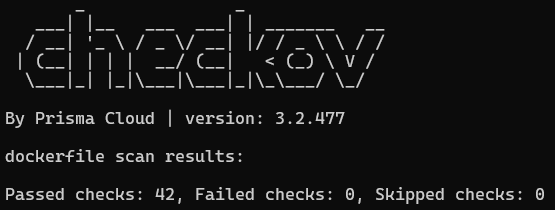

Sin embargo, realizadas estas correcciones y levantando el docker-compose.yml, nos damos cuenta de que la aplicación no funciona, especificamente el servicio de **nginx**. Esto es debido a que seteamos a un usuario no-root en el comando CMD (y en todos los comandos subsiguientes), indicandole a Docker de que el contenedor no tiene permisos para realizar cambios en el archivo nginx.pid, impidiendole al contenedor ejecutarse correctamente y resultando en que no tengamos un puerto de acceso desde nuestro host para acceder a la página web.

Error que figura en los logs del contenedor "todos-nginx":
```LOG
2025/10/12 20:30:17 [emerg] 1#1: open() "/run/nginx.pid" failed (13: Permission denied)
nginx: [emerg] open() "/run/nginx.pid" failed (13: Permission denied)
```
Luego de sucesivos intentos de querer corregir esta vulnerabilidad identificada por checkov, concluimos con que no vale la pena cumplir con este criterio ya que la imagen base nginx:alpine ya maneja privilegios internamente y está diseñada para operar de forma segura.


---
## Análisis Imagen "mysql:8.0":

Utilizamos como imagen base y única para la base de datos a mysql:8.0, por lo tanto solo podremos realizar un prueba de trivy que nos dió lo siguiente:

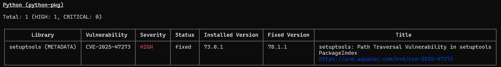

Una sola vulnerabilidad de tipo HIGH en esta imagen. La razón por la que aparece un paquete de Python como origen de esta vulnerabilidad es porque mysql:8.0 recordemos es una imagen que tiene como base un sistema operativo como Debian, por lo que tiene una gran variedad de dependencias de las cuales pueden surgir vulnerabilidades de este tipo. Esta dependencia representa una vulnerabilidad que puede ser explotada por terceros para manipular archivos e incluso escalar privilegios, poniendo en peligro no solo al contenedor, sino al host en si.

Por lo tanto procedemos a crear un Dockerfile personalizado:

```DOCKERFILE
FROM mysql:9.4
COPY ./init-scripts/*.sql /docker-entrypoint-initdb.d/
EXPOSE 3306
VOLUME ["/var/lib/mysql"]
```

## Análisis nueva Imagen "todos-db":

A partir del Dockerfile anteriormente creado creamos una imagen "todos-db", por lo que ahora si procedemos a realizarle las dos pruebas de trivy y checkov:

#### Trivy:

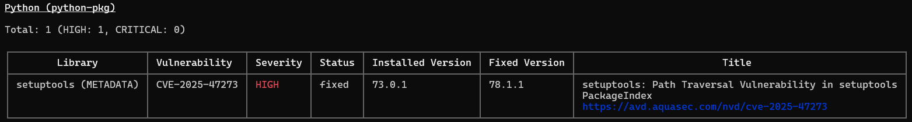

Con el objetivo de ver si las vulnerabilidades se resolvían, actualizamos la versión de mysql oficial de 8.0 a 9.4. Sin embargo, seguimos presentando la misma vulnerabilidad que antes.

Para tratar de solventar la vulnerabilidad se intentaron diversas estrategias:

1.  Cambiamos de una imagen mysql:9.4 a otra imagen oficial pero mas liviana basada en mysql, mariadb:10.11.14-jammy. Esto con el objetivo de reducir la imagen y ver si se reducían estas vulnerabilidades, o aumentaban en el peor de los casos.\
    En nuestro caso aumentaron:\
    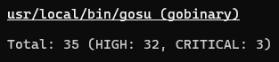\
    Estas vulnerabilidades provienen de una biblioteca llamada "stlib" y otra dependencias del binario "gosu" que fue compilado en una versión antigua de Go lo que lo hace especialmente vulnerable a una gran cantidad de fallos de seguridad que ya fueron parcheados.

2.  Luego de sucesivos intentos fallidos de eliminar estas vulnerabilidades de la imagen base de mariadb, volvimos a mysql:9.4 para tener de nuevo 1 vulnerabilidad de tipo HIGH (aunque 500MB mas de peso).

3.  Al crear la imagen en base a nuestro Dockerfile y levantar los contenedores para correr nuestro sitio web nos topamos con el siguiente error:\
    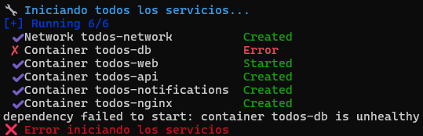\
    Cómo los logs de la terminal no nos arroja mucha información, consultamos los logs del contenedor en ejecución de la BD pero que está en estado UNHEALTHY. En estos observamos lo siguiente:
    ```log
    [ERROR] [InnoDB] Tablespace flags are invalid in datafile:
    ./ibdata1
    [ERROR] [InnoDB] Corrupted page [page id: space=0, page
    number=0] of datafile './ibdata1'
    [ERROR] [Server] Failed to initialize DD Storage Engine
    [ERROR] [Server] Data Dictionary initialization failed.
    ```
    Esto nos indica de que hay una inconsistencia con el volumen /var/lib/mysql que le da persistencia a los datos de nuestra base de datos. Esto se debe normalmente a una incompatibilidad surgida la hacer cambios entre distintas imagenes de bases de datos (mysql -> mariadb -> mysql).\
    \
    ¿Cómo lo solucionamos? Borrando el volumen de datos que teníamos y creando uno nuevo, permitiendo a mysql reestablecer su estructura.\
    Levantando el docker-compose de nuevo vemos que la imagen de todos-db pudo ejecutarse como contenedor correctamente:\
    

4.  Entonces, volvemos al punto desde donde partimos, con una imagen base de mysql:9.4 y una vulnerabilidad de tipo HIGH.\
    Para resolverla tratamos de utilizar la siguiente instrucción en el dockerfile que construye la imagen:

    ```dockerfile
    RUN microdnf install -y python3-pip && pip install --no-cache-dir --upgrade pip setuptools==78.1.1 && microdnf clean all
    ```

    Esta tiene como objetivo el instalar la versión que corrige la vulnerabilidad de "setuptools".\
    Creamos la imagen y probamos de nuevo con trivy:\
    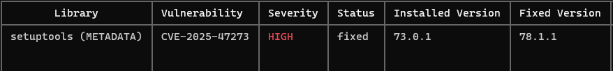\
    La vulnerabilidad persiste.

5.  Como conclusión, determinamos que la alerta se trata de un falso positivo, ya que al ser un problema inherente en la imagen que usamos de base, trivy siempre escaneará esa imagen y se topará con esa vulnerabilidad, por mas de que la reparemos para nuestra imagen final. Por lo que podríamos decir que nuestra imagen no tiene vulnerabilidades importantes.

#### Checkov:

Ejecutamos análisis checkov en nuestro directorio ./db:

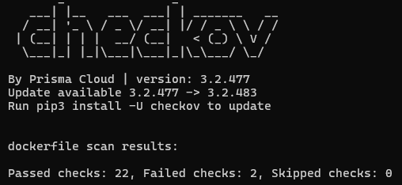

Vemos que contamos con menos checks de lo habitual, esto es debido a que poseemos un dockerfile mas simplificado.

Dentro de los dos Failed checks encontrados podemos observar los mismos que hemos detectado con anterioridad: el de HEALTHCHECK y Usuario.

**Resolviendo CKV_DOCKER_2:**

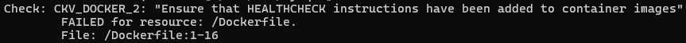

Adaptamos la instrucción HEALTHCHECK de nuestro docker-compose.yml a nuestro Dockerfile:

```
HEALTHCHECK --interval=30s --timeout=20s --retries=10 \\

CMD mysqladmin ping -h localhost || exit 1
```

Y ya con eso bastaría para hacer pasar el test.

**Resolviendo CKV_DOCKER_3:**

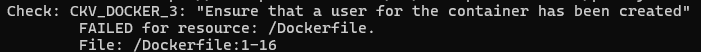

Probamos agregando los siguientes comandos justo después de cargar la imagen base para crear un usuario de sistema o no root y asignarselo a las carpetas correspondientes que usará:

```dockerfile
RUN groupadd -r mysqluser && useradd -r -g mysqluser mysqluser
RUN chown -R mysqluser:mysqluser /var/lib/mysql && chown -R mysqluser:mysqluser /var/run/mysqld
```

Y el siguiente comando (que se ubica al final del dockerfile) es para indicarle al contenedor que usará este usuario sin privilegios.
```dockerfile
USER mysqluser
```
Sin embargo esto arroja de nuevo un error por falta de permisos:

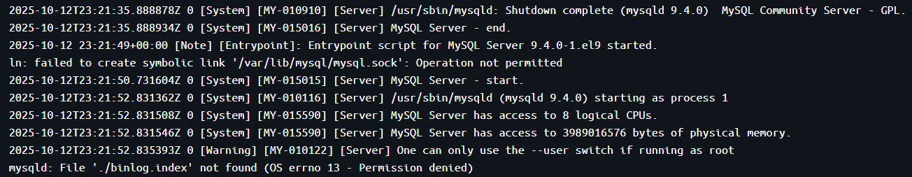

Esto sucede porque se están intentando ejecutar proces de mysql (como realizar operaciones dentro del volumen definidos) sin tener un usuario root. El host espera que para interactuar con el volumen haya un usuario root, pero como le pasamos uno no-root genera estas denefaciones de permisos.

La solución de este error escapa de nuestros conocimientos (por el momento) por lo que vamos hacer un roll-back y no resolver este test en checkov.


---
## Análisis Imagen "todos-web":

#### Trivy:
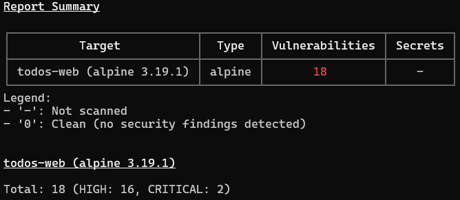

Realizando un primer análisis a la imagen construida del microservicio frontend React web, podemos observar que se encontraron 18 vulnrabilidades, 16 de tipo HIGH y 2 de tipo CRITICAL.

La raiz de todas estas vulnerabilidades se trata de nuevo de la imagen base nginx:1.25-alpine que usamos. Son las mismas vulnerabilidades detectadas en el análisis con Trivy en la imagen "todos-nginx", por lo que probamos el aplicarle la misma solución, actualizarla a nginx:1.29-alpine.

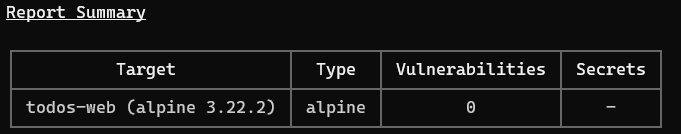

Vemos que efectivamente, al realizar esta actualización de la imagen base trae consigo el parcheo de todas las vulnerabilidades relevantes que el análisis mostró.

#### Checkov:

Realizamos un análisis estático con checkov ahora y nos arroja las dos vulnerabilidades que vimos anteriormente.

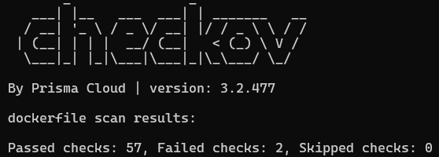

**Resolviendo CKV_DOCKER_2:**


Cargamos el siguiente comando en el dockerfile:

```dockerfile
HEALTHCHECK --interval=30s --timeout=10s --retries=3 CMD curl -f http://localhost:3000/health || exit 1
```

Y listo, test resuelto.

**Resolviendo CKV_DOCKER_3:**
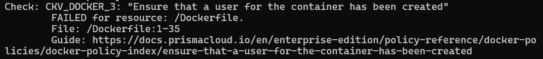

Para solucionar esta vulnerabilidad probamos lo siguiente:

Primero añadimos un grupo de usuario y un usuario nginxuser no-root a este grupo.
```dockerfile
RUN addgroup -S nginxgroup && adduser -S nginxuser -G nginxgroup
```
Luego definimos cuales carpetas usará este usuario dentro de nuestro contenedor.
```dockerfile
RUN chown -R nginxuser:nginxgroup /usr/share/nginx/html && \\
  chown -R nginxuser:nginxgroup /var/cache/nginx && \\
  chown -R nginxuser:nginxgroup /var/log/nginx && \\
  chown -R nginxuser:nginxgroup /etc/nginx/conf.d && \\
  touch /var/run/nginx.pid && \\
  chown -R nginxuser:nginxgroup /var/run/nginx.pid
```
Y por último, asignamos al contenedor este usuario que estuvimos creando y configurando.
```dockerfile
USER nginxuser
```
Con todo esto realizado, creamos de nuevo nuestra imagen y levantamos nuestro sitio web mediante docker-compose.

Sorprendentemente, el sitio se levantó con éxito y no hubieron problemas respecto a denegación de servicios con nuestro contenedor. El por qué funcionó con este contenedor la asignación de usuarios pero no con el de mysql resulta confuso, pero esto puede deberse a muchas razones, principalmente a que nginx representa una imagen mas flexible en cuanto a cambios, mientras que la imagen base mysql es mas estructurada y mucho mas compleja ya que en esta se realizan transacciones de persistencia de datos, algo a lo que hay que tener un control particular cuando de permisos se trata.

Ejecutamos el test con checkov de nuevo y vemos que todos los tests pasaron.

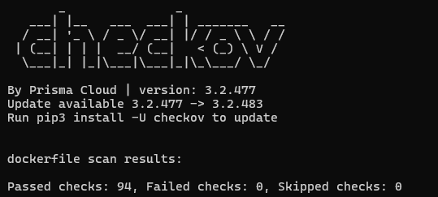

---
## Análisis Imagen "todos-notifications":

#### Trivy:
Realizamos el análisis de Trivy para esta imagen, en donde se nos presentan 6 vulnerabilidades, todas provenientes de la imagen base de python:3.11-slim
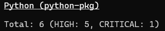

En donde la única critica que se presenta (la cual trata sobre un problema de confusión de algorítmos) es la siguiente:

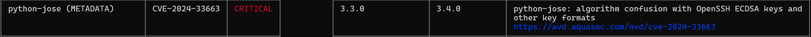

Y se encuentra también una vulnerabilidad sin parche:

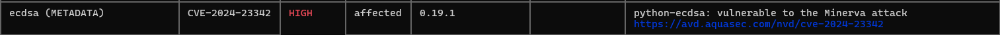

Vemos que todos estas vulnerabilidades tienen como imagen raiz a python:3.11-slim, por lo que, cómo solución, proponemos el actualizar todas las dependencias que tengan una versión corregida y que se encuentran en nuestro archivo requirements.txt:

- python-jose3.3.0 **=>** 3.4.0python-jose

- python-multipart0.0.6 **=>** 0.0.18

- starlette0.27.0 **=>** 0.40.0

- orjson3.9.10 **=>** 3.9.15

- ecdsa0.19.1 **=>** 0.19.2 (Asumiendo que es la última versión)

Cabe resaltar que habían algunas dependencias que no estaban explicitadas en el txt. Estas se llaman dependencias transitivas, es decir, dependencias de dependencias. Este es el caso para ecdsa (dependencia de python-jose) y starlette (dependencia de fastapi).

Hecho esto, levantamos los contenedores para ver si funciona nuestro sitio web, pero nos topamos con el siguiente error al construir la imagen:

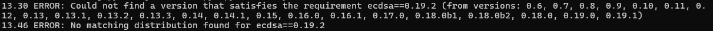

Este surge debido a un descuido nuestro de colocar arbitrariamente una versión que creíamos que existía de ecdsa para ver si con ello se solucionaba la vulnerabilidad, pero el mensaje nos indica que justamente la versión 0.19.1 es la última y debido a ello no hay un parche disponible (todavía).

Cambiamos de nuevo a la versión de ecdsa que ya teníamos (la 0.19.1) y volvemos a levantar los contenedores.

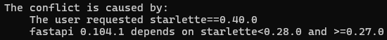

Otro error se hace a la vista. Este trata de que la dependencia fastapi, la cual, con su versión 0.104.1, no es compatible con la versión propuesta por trivy para solucionar la vulnerabilidad (0.40.0). Por ello buscamos una versión de fastapi que sea compatible con la versión 0.40.0 de starlette.

Luego de una breve búsqueda nos quedamos con fastapi==0.118.0. Guardamos y volvemos a ejecutar el script que levanta nuestro sitio web con la esperanza de que esta acción se realiza con éxito.


Para nuestra fortuna, el contenedor se levantó exitosamente.

Ejecutamos de nuevo el scaner con trivy a nuestra nueva imagen:

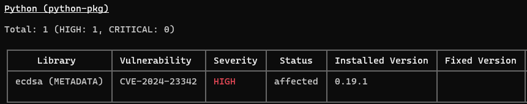

Vemos que resulta solamente nos queda la vulnerabilidad de ecdsa que, como mencionamos antes, no tiene un parche disponible, por lo que con ello concluimos nuestro análisis.

#### Checkov:

Al ejecutar este análisis también surgieron las vulnerabilidades CKV_DOCKER_2 y CKV_DOCKER_3, por lo que procedimos a resolverlos de una manera similar a la anterior. Levantamos el sitio web con estos arreglos y funcionó de manera adecuada. Ejecutamos de nuevo el test de checkov y como resultado todas las pruebas han pasado con éxito.

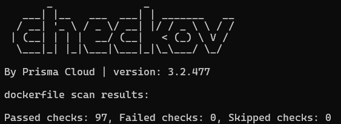

---
## Gestión de Secretos
En este apartado no nos explayaremos sobre el cómo implementamos los secretos (para ello visitar [SECRETS.md](SECRETS.md)), sino en la herramienta que utilizamos para verificar que las variables de entorno sensibles que manipulamos en nuestros dockerfiles o docker-compose no se expongan. La herramienta utilizada será, como se dijo al principio de este documento, ```detect-secrets```.

Luego de instalarlo, utilizamos el siguiente comando en la raiz de nuestro proyecto: ```detect-secrets scan > .secrets.baseline```

Cuando lo ejecutemos, la salida del escaneo será redirigida a un archivo que se creará en nuestro directorio raiz, el cual tendrá información en formato JSON. De esta nos interesará el apartado "results". En nuestro caso, nos arroja dos archivos que tienen vulnerabilidades expuestas, un archivo ERRORES.md y otro simple_app.py:
#### > ERRORES.md
El análisis nos arrojó la siguiente salida:
```json
"READMES/ERRORES.md": [
      {
        "type": "Secret Keyword",
        "filename": "READMES/ERRORES.md",
        "hashed_secret": "30f9353a0df8b39e672f2fea995fad3c21d91345",
        "is_verified": false,
        "line_number": 153
      },
      {
        "type": "Secret Keyword",
        "filename": "READMES/ERRORES.md",
        "hashed_secret": "bb68f4c90c0332dda68e1d5088a3d241432d5b4f",
        "is_verified": false,
        "line_number": 154
      }
    ]
```
En esta, detect-secrets nos señala dos vulnerabilidades. Se trata de dos claves expuestas tanto en la linea 153 como 154. Revisemoslas:
```bash
152: WARNING: Se encontraron credenciales en el código fuente
153: SMTP_PASSWORD = "mi_password_real_123"
154: DB_PASSWORD = "root_password"
```
En este caso, el resultado del escaneo se trata de un falso positivo, es decir, no hay ninguna clave expuesta ya que se trata de un error o mala práctica encontrada en el desarrollo del proyecto que ya se ha tratado con anterioridad.

Resulta interesante sin embargo lo exhaustivo que puede ser detect-secrets como para fijarse en archivos tipo .md para informar sobre estas vulnerabilidades. Aunque igualmente por ello se debe de saber identificar cuando un resultado es verdadero o falso.

#### > simple_app.py
Este es el segundo y último resultado que arrojó detect-secrets:
```json
    "notifications/simple_app.py": [
      {
        "type": "Secret Keyword",
        "filename": "notifications/simple_app.py",
        "hashed_secret": "747e493eec20f1cb87578e65fc2aa59447f713f3",
        "is_verified": false,
        "line_number": 53
      },
      {
        "type": "Secret Keyword",
        "filename": "notifications/simple_app.py",
        "hashed_secret": "886f550a66f238d69428b3ad0a6980ad8530f1ca",
        "is_verified": false,
        "line_number": 93
      }
    ]
```
Haciendo una breve revisión, podemos observar que hay dos claves expuestas tanto en la linea 53 como 93. Hechemosle un vistazo:

**Linea 53:**
```python
50: fallback_values = {
51:     "smtp_username": "tomascarrio7373@gmail.com",
52:     "smtp_password": "kzfb khzj gbjw mqxo"
53: }
```
Podemos ver que en efecto hay una clave que está expuesta a la interperie en nuestro código, la cual se trata de una contraseña para nuestro servidor smtp que se encarga del envío de notificaciones por mail dentro del microservicios "notifications". Esta debe ser cifrada o protegida, sin embargo, como todavía nos encontramos en un ambiente de desarrollo esto todavía no representa una urgencia.

**Linea 93:**
```python
93: if not MI_EMAIL or MI_EMAIL == "tu-email@gmail.com" or not MI_PASSWORD or MI_PASSWORD == "tu-app-password-aqui":
94:    logger.warning("⚠️  Credenciales SMTP no configuradas, simulando envío")
95:    logger.info(f"📧 SIMULANDO ENVÍO DE EMAIL:")
```
Podemos observar que no se trata de ningún token o clave sensible o que resulte peligrosa de exponer ya que son de ejemplo o validación. Estos valores son los que se encuentran en nuestros secrets y cuyos valores deben ser reemplazados al momento de querer correr la aplicación mediante contenedores, ya que son meramente de demostración.

Cabe resaltar de que no se encontró ninguna vulnerabilidad tanto en nuestro dockerfiles como docker-compose, por lo que podemos concluir de que estos manejan correctamente los secretos y valores sensibles, demostrando así que nuestra arquitectura es bastante robusta y segura. Lo único que habría que gestionar como secretos sería la contraseña del smtp que se usa para el envío de mails.
